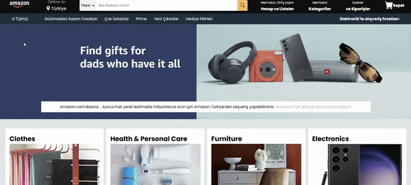

# Amazon Clone

"Bu proje, Amazon web sitesinin temel işlevselliğini taklit eden bir HTML5 ve CSS3 ile yapılmış bir klondur. Kullanıcı dostu arayüz ve modern tasarım öğeleri kullanılarak Amazon'un ana sayfası, ürün kategorileri, menü yapısı ve temel sayfa düzeni oluşturulmuştur.

# Ekran Görüntüsü

